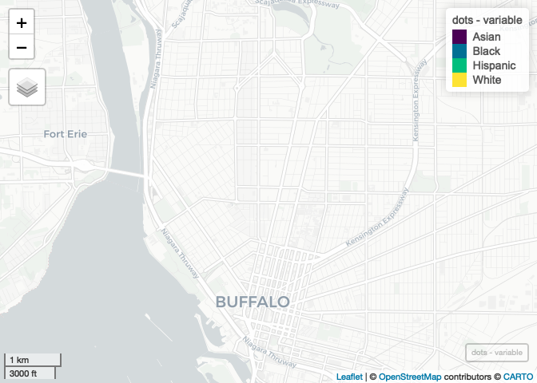

Case Study 11
================
Bhavana Poladi
November 19, 2020

# LOADING PACKAGES

``` r
library(tidyverse)
library(spData)
library(sf)
library(mapview) 
library(foreach)
library(doParallel)
library(raster)
library(tidycensus)
webshot::install_phantomjs()

registerDoParallel(4)
getDoParWorkers()
```

    ## [1] 4

# API KEY

``` r
readRenviron("~/.Renviron")
Sys.getenv("CENSUS_API_KEY")
```

    ## [1] "a436bdafda87b5a73060cb82c5910160a0c414e5"

# DOWNLOADING THE CENSUS DATA

``` r
racevars <- c(White = "P005003", 
              Black = "P005004", 
              Asian = "P005006", 
              Hispanic = "P004003")

options(tigris_use_cache = TRUE)
erie <- get_decennial(geography = "block", variables = racevars, 
                      state = "NY", county = "Erie County", geometry = TRUE,
                      summary_var = "P001001", cache_table=T) 
```

# CROPPING THE COUNTY LEVEL DATA

``` r
county_crop <- c(xmin=-78.9,xmax=-78.85,ymin=42.888,ymax=42.92)
erie2 <- st_crop(erie, county_crop)
```

# GENERATING DOTS

``` r
var <- as.factor(erie2$variable)

dots <- foreach(i = 1:4, .combine='rbind') %dopar% {
  races <- levels(var)[i]
  erie2 %>%
    filter(variable == races) %>%
    st_sample(size = .$value) %>%
    st_as_sf() %>%
    mutate(variable = races)
} #got help from Ting Chang
```

# PLOT

``` r
plot <- mapview(dots, zcol = "variable", cex = 1, lwd=0) 
plot
```

<!-- -->
